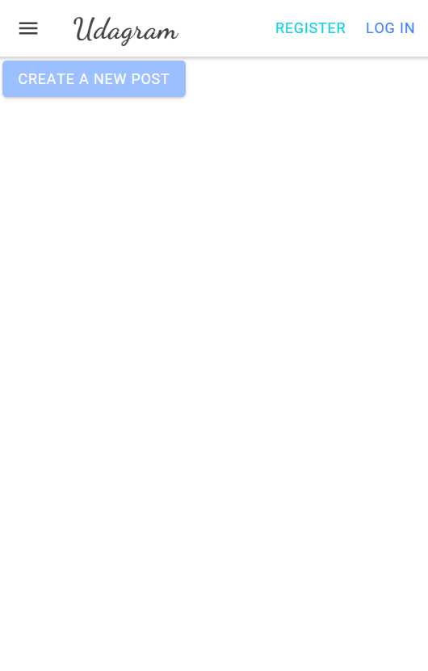

# Udagram

---

## Project Overview

Udagram is an Image filtering application, that allows users to allows users to register and log into a web client, post photos to the feed, and process photos using an image filtering service.

It has two components:

- Front-end, which is an angular web application built using the [Ionic](https://ionicframework.com/) framework
- Back-end, which is a RESTful API built using Node, and is written in Typescript

The application can be reached [here](http://deployementprocessprojectbucket.s3-website.us-east-2.amazonaws.com)

## Documentation

- [Application Dependencies](/docs/Application_dependencies.md)
- [Infrastructure Documentation](/docs/Infrastructure_description.md)
- [Pipeline Documentation](/docs/Pipeline_description.md)

## Testing

This project contains two different test suite: unit tests and End-To-End tests(e2e). Follow these steps to run the tests.

1. `cd starter/udagram-frontend`
1. `npm run test`
1. `npm run e2e`

There are no Unit test on the back-end

### Unit Tests:

Unit tests are using the Jasmine Framework.

### End to End Tests:

The e2e tests are using Protractor and Jasmine.

## Built With

- [Angular](https://angular.io/) - Single Page Application Framework
- [Node](https://nodejs.org) - Javascript Runtime
- [Express](https://expressjs.com/) - Javascript API Framework

## License

[License](LICENSE.txt)

---

This project was developed by Abdulrahman Alosaimi as a project for the Full Stack JavaScript Developer Nanodegree
